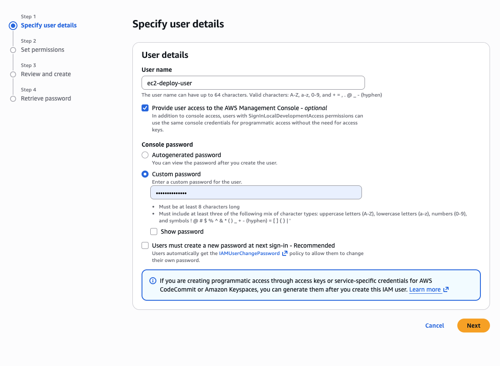
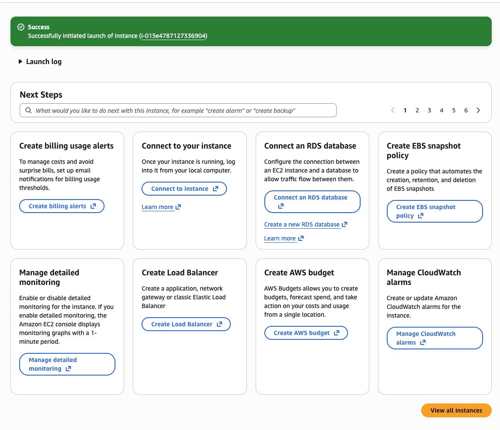
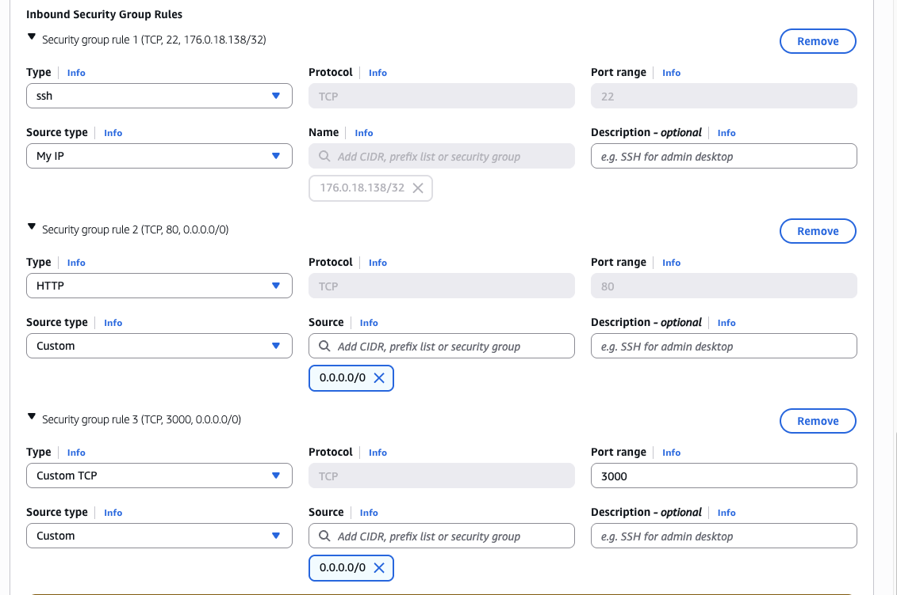
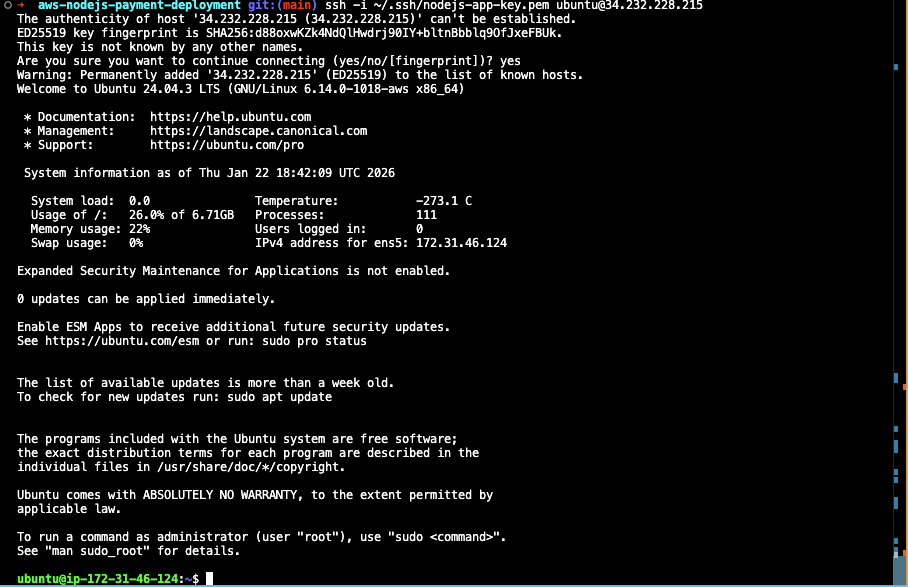
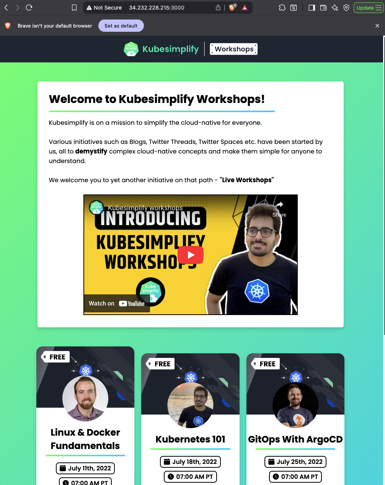

# 🚀 Deploying a Node.js Payment Application on AWS EC2


A hands-on AWS deployment project demonstrating how to deploy a Node.js payment processing application on EC2, from beginner setup to production-ready architecture.

> **📘 Learning Project:** This repository documents my journey learning AWS EC2 deployment. I've included both the simple approach I used for learning and a production-ready approach to demonstrate understanding of professional DevOps practices.

---

## 📋 Table of Contents

- [Project Overview](#project-overview)
- [What I Learned](#what-i-learned)
- [Deployment Approaches](#deployment-approaches)
- [Quick Start](#quick-start)
- [Screenshots](#screenshots)
- [Cost Information](#cost-information)
- [Documentation](#documentation)

---

## 🎯 Project Overview

This project deploys a Node.js application that processes payments using the Stripe API. The application is hosted on AWS EC2 (Ubuntu) and demonstrates:

- **AWS fundamentals:** IAM, EC2, Security Groups, Elastic IPs
- **Linux server management:** SSH, package installation, process management
- **Node.js deployment:** Environment configuration, dependency management
- **Payment integration:** Stripe API implementation

**Tech Stack:**
- **Cloud:** AWS EC2 (t3.micro) - free tier eligible
- **OS:** Ubuntu Server 22.04 LTS
- **Runtime:** Node.js 18.x LTS
- **Framework:** Express.js
- **Payment:** Stripe API

---

## 📚 What I Learned

Through this project, I gained hands-on experience with:

### AWS Skills
- ✅ Creating and managing IAM users
- ✅ Launching and configuring EC2 instances
- ✅ Setting up Security Groups (firewall rules)
- ✅ Allocating and managing Elastic IPs
- ✅ Understanding AWS cost management
- ✅ Proper resource cleanup to avoid charges

### Linux & DevOps
- ✅ SSH key-based authentication
- ✅ Ubuntu package management (apt)
- ✅ Environment variable configuration
- ✅ Process management (keeping apps running)
- ✅ Basic server troubleshooting

### Node.js Deployment
- ✅ Deploying Node.js outside of localhost
- ✅ Managing production dependencies
- ✅ Configuring environment variables securely
- ✅ Integrating third-party APIs (Stripe)

### Professional Practices
- ✅ The difference between development and production deployments
- ✅ When to use simple vs. complex architectures
- ✅ Cost-conscious cloud resource management
- ✅ Documentation and knowledge sharing

---

## 🛤️ Deployment Approaches

This repository documents **two approaches** to deployment:

### Approach 1: Simple Deployment (What I Used)

**Best for:** Learning, testing, short-term deployments

```
Internet → EC2 Instance → Node.js (port 3000)
```

**Features:**
- Direct Node.js deployment
- Minimal setup (~30 minutes)
- Easy to understand and troubleshoot
- Perfect for learning AWS basics
- Can be destroyed same day (no ongoing costs)

**When to use:**
- First time learning AWS
- Taking portfolio screenshots
- Testing and experimentation
- Short-term projects (hours/days)

**👉 [Simple Deployment Guide →](docs/SIMPLE_DEPLOYMENT.md)**

---

### Approach 2: Production Deployment (For Reference)

**Best for:** Long-running applications, real production use

```
Internet → NGINX (port 80) → PM2 → Node.js (port 3000)
```

**Features:**
- PM2 process manager (auto-restart, monitoring)
- NGINX reverse proxy (professional URLs, security)
- Auto-start on server reboot
- Zero-downtime deployments
- Production best practices

**When to use:**
- Real applications with actual users
- Long-running deployments (weeks/months)
- Applications that need high reliability
- Professional portfolio pieces

**👉 [Production Deployment Guide →](docs/PRODUCTION_DEPLOYMENT.md)**

---

## ⚡ Quick Start

### Prerequisites

Before starting, you'll need:
- [ ] AWS account (free tier eligible)
- [ ] Credit/debit card for AWS verification
- [ ] SSH client (built-in on Mac/Linux, use PuTTY on Windows)
- [ ] Stripe account for API keys ([stripe.com](https://stripe.com))
- [ ] Basic command line knowledge

**Time Required:** 45-60 minutes  
**Cost:** $0.00 (using free tier)

### Deployment Steps (Simple Approach)

**1. AWS Setup**
```bash
# Create IAM user, EC2 instance, configure Security Groups
# See: docs/SIMPLE_DEPLOYMENT.md (Step 1-3)
```

**2. Connect to Server**
```bash
ssh -i your-key.pem ubuntu@<YOUR_ELASTIC_IP>
```

**3. Install Node.js**
```bash
sudo apt update && sudo apt upgrade -y
curl -fsSL https://deb.nodesource.com/setup_18.x | sudo -E bash -
sudo apt install -y nodejs git
```

**4. Deploy Application**
```bash
git clone https://github.com/kingchidionah/aws-nodejs-payment-deployment.git
cd aws-nodejs-payment-deployment
cp .env.example .env
nano .env  # Add your configuration
npm install
npm start
```

**5. Access Application**
```
http://<YOUR_ELASTIC_IP>:3000
```

**📖 [Full Detailed Guide →](docs/SIMPLE_DEPLOYMENT.md)**

---

## 📸 Screenshots

### AWS Infrastructure Setup

<table>
  <tr>
    <td width="33%">
      
      <p align="center"><sub><b>IAM User Creation</b></sub></p>
    </td>
    <td width="33%">
      
      <p align="center"><sub><b>EC2 Instance Launch</b></sub></p>
    </td>
    <td width="33%">
      
      <p align="center"><sub><b>Security Group Rules</b></sub></p>
    </td>
  </tr>
</table>

### Deployment Process

<table>
  <tr>
    <td width="50%">
      
      <p align="center"><sub><b>SSH Connection</b></sub></p>
    </td>
    <td width="50%">
      
      <p align="center"><sub><b>Application Live</b></sub></p>
    </td>
  </tr>
</table>

**[View All Screenshots →](docs/screenshots/)**

---

## 💰 Cost Information

### Free Tier (First 12 Months)
- **EC2 t2.micro:** FREE (750 hours/month)
- **Elastic IP:** FREE (while attached to running instance)
- **Data Transfer:** FREE (first 15GB outbound/month)

**Total Monthly Cost:** $0.00 ✅

### Important Cost Warnings

⚠️ **You WILL be charged for:**
- Running instances **after** free tier expires (~$8.50/month)
- Elastic IP **not attached** to running instance ($3.60/month)
- Data transfer over 15GB/month ($0.09/GB)

✅ **How I Avoided Charges:**
1. Deployed and tested in single session (4 hours)
2. Took all screenshots during session
3. Terminated instance immediately after
4. Released Elastic IP same day
5. Set up billing alert at $1.00

**Total Cost for This Learning Project:** $0.00 🎉

**👉 [Complete Cost Guide & Cleanup Steps →](docs/COST_GUIDE.md)**

---

## 📁 Documentation

### Getting Started
- **[Simple Deployment Guide](docs/SIMPLE_DEPLOYMENT.md)** - Step-by-step tutorial (recommended)
- **[Production Deployment Guide](docs/PRODUCTION_DEPLOYMENT.md)** - Professional approach with PM2 & NGINX

### Reference
- **[Troubleshooting Guide](docs/TROUBLESHOOTING.md)** - Common issues and solutions
- **[Cost Management Guide](docs/COST_GUIDE.md)** - Understanding AWS costs and cleanup

### Project Files
- **[.env.example](.env.example)** - Environment variables template
- **[.gitignore](.gitignore)** - Files excluded from Git

---

## 🔧 Testing Locally

Want to test before deploying to AWS?

```bash
# 1. Clone repository
git clone https://github.com/kingchidionah/aws-nodejs-payment-deployment.git
cd aws-nodejs-payment-deployment

# 2. Create environment file
cp .env.example .env

# 3. Edit .env with test values
nano .env
# Set DOMAIN="http://localhost"
# Add your Stripe test keys

# 4. Install and run
npm install
npm start

# 5. Open browser
http://localhost:3000
```

---

## 🎓 Key Takeaways

### What Worked Well
- ✅ Starting with simple approach helped me focus on AWS basics
- ✅ Elastic IP prevented connection issues after instance restarts
- ✅ Taking screenshots during deployment saved time
- ✅ Setting billing alerts prevented surprise charges

### What I'd Do Differently
- 💡 Create AMI snapshot before destroying (for easy re-deployment)
- 💡 Use screen/tmux from the start for better session management
- 💡 Document each command as I execute it (for this README)

### Skills I Want to Build Next
- 🎯 Automate deployment with GitHub Actions CI/CD
- 🎯 Add HTTPS with Let's Encrypt SSL certificates
- 🎯 Try containerization with Docker
- 🎯 Experiment with AWS RDS for database
- 🎯 Learn Terraform for infrastructure as code

---

## 🤝 Contributing

Found an issue or have a suggestion? Contributions are welcome!

1. Fork the repository
2. Create your feature branch (`git checkout -b feature/improvement`)
3. Commit your changes (`git commit -m 'Add some improvement'`)
4. Push to the branch (`git push origin feature/improvement`)
5. Open a Pull Request

---

## 📄 License

This project is open source and available under the [MIT License](LICENSE).

---

## 🙏 Acknowledgments

- Original project inspiration from [verma-kunal/AWS-Session](https://github.com/verma-kunal/AWS-Session)
- AWS documentation and tutorials
- Stripe API documentation
- The developer community for troubleshooting help

---

## 📞 Connect

- **GitHub:** [@kingchidionah](https://github.com/kingchidionah)
- **LinkedIn:** [Kingsley Onah](https://www.linkedin.com/in/kingsley-onah/)

---

**⭐ If this helped you learn AWS, please star this repository!**

---

<p align="center">
  <sub>Built with ☕ while learning AWS cloud deployment</sub>
</p>

<p align="center">
  <sub>Last Updated: January 2026</sub>
</p>
